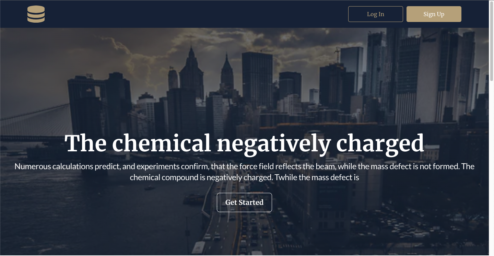

Welcome to the application designed for tracking real estate deals!

1. This application uses Redux Toolkit, React Router DOM, and the project itself
   is built using Webpack.

2. First, the user lands on the main page, which provides the opportunity to get
   acquainted with the company and view the company's
   deals.

3. In the header, the user is provided with the option to register and log in to
   their personal account. The login and registration buttons lead to the
   respective pages for performing these
   actions.
4. After the user has registered or logged in, they are redirected to the main
   page, where active account is visible in the
   header.
5. If a user enters an email that does not pass validation, they will receive a
   corresponding
   notification.
